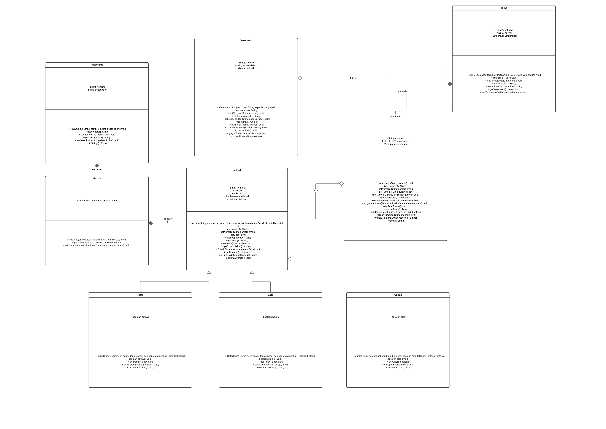

<!DOCTYPE html>
<html lang="en">
<head>
    <meta charset="UTF-8">
    <meta name="viewport" content="width=device-width, initial-scale=1.0">
    
</head>
<body>
    <h1>Parcial 2 Ejercicio 1</h1>
    Implementa una funcionalidad para recibir distintos tipos de animales en una veterinaria y realizar tratamientos específicos según el tipo de animal y su estado de salud. Describe cómo los objetos se relacionan para que los veterinarios completen el tratamiento adecuado para cada caso en la clínica.
Define al menos 3 métodos clave que los objetos se envían entre sí para realizar los tratamientos específicos de cada tipo de animal (por ejemplo, examinarPatas() en Perro, examinarPlumas() en Ave).

  
    
    
    
</body>
</html>
